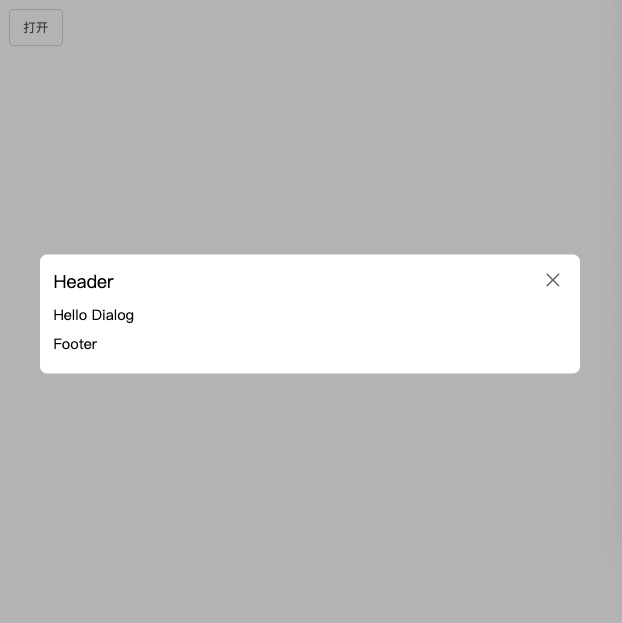

# Icon 图标

**API**

| 属性 | 说明 | 类型 | 可选值 | 默认值 |
| :-: | :-: | :-: | :-: | :-: |
| type | icon样式代码 | String | [CgUI图标库](http://icon.codegorgeous.top) | 无 |
| size | icon样式大小 | Number | 无 | 16 |
| color | icon样式颜色 | String | 无 | #ccc |

**示例图**

**Icon样式代码请前往: [CgUI图标库](http://icon.codegorgeous.top)**

## h2测试标题1

# Button 按钮

**API**

| 属性 | 说明 | 类型 | 可选值 | 默认值 |
| :-: | :-: | :-: | :-: | :-: |
| type | 按钮类型 | String | 无 | 无 |
| disabled | 禁用按钮 | Boolean | true/false | false |
| ghost | 背景是否透明化 | Boolean | true/false | false |
| icon | Icon图标 | String | [Icon图标库](http://icon.codegorgeous.top) | 无 |

**示例图**

## h2测试标题2

# Praise 好评

**API**

| 属性 | 说明 | 类型 | 可选值 | 默认值 |
| :-: | :-: | :-: | :-: | :-: |
| quantity | 选中的数量 | Number | 无 | 0 |
| size | 图标的大小 | Number | 无 | 16 |
| disabled | 禁用按钮 | Boolean | true/false | false |

**示例图**

# Empty 空数据

**API**

| 属性 | 说明 | 类型 | 默认值 |
| :-: | :-: | :-: | :-: |
| title | 文字说明 | String | 'Not Data' |

**示例图**

## h2测试标题3

# Input 输入框

**API**

| 属性 | 说明 | 类型 | 可选值 | 默认值 |
| :-: | :-: | :-: | :-: | :-: |
| value.sync | 输入框绑定数据 | String | 无 | '' |
| placeholder | 输入框默认显示 | String | 无 | '请输入内容' |
| icon | 输入框图标 | String | [Icon图标库](http://icon.codegorgeous.top) | '' |
| disabled | 输入框是否禁用 | Boolean | true/false | false |

**Events**

| 事件名称 | 事件说明 | 回调参数 |
| :-: | :-: | :-: |
| inputOpenShow | 焦点聚焦输入框 | 无 |
| inputCloseShow | 焦点移出输入框 | 无 |

**示例图**

# Select 下拉输入框

**API**

| 属性 | 说明 | 类型 | 可选值 | 默认值 |
| :-: | :-: | :-: | :-: | :-: |
| data | 下拉菜单数据 | Array | 无 | [] |

**Events**

| 事件名称 | 事件说明 | 回调参数 |
| :-: | :-: | :-: |
| selectValue | 选择下拉列表的数据 | 目标选中值 |

**示例图**

# Image 图片

**API**

| 属性 | 说明 | 类型 | 可选值 | 默认值 |
| :-: | :-: | :-: | :-: | :-: |
| url | img原生url | String | 无 | 无 |
| alt | img原生alt | String | 无 | '' |
| width | 图片宽度 | String | 无 | 100% |
| height | 图片高度 | String | 无 | 100% |
| radius | 图片圆角 | Number | 无 | 0 |

**示例图**

# Carousel 走马灯

**API**

| 属性 | 说明 | 类型 | 可选值 | 默认值 |
| :-: | :-: | :-: | :-: | :-: |
| automatic | 是否自动轮播 | Boolean | true/false | true |
| intervalTime | 轮播间隔 | Number | 无 | 3000 |
| playType | 轮播方式 | String | carousel/opacity | carousel |
| initialIndexes | 初始轮播图的索引 | Number | 无 | 0 |
| ifShowIndexes | 是否显示索引按钮 | Boolean | true/false | true |
| indexesShow | 索引切换方式 | String | click/hover | hover |
| ifShowSwitchBtn | 是否显示左右切换按钮 | Boolean | true/false | true |
| switchBtnShow | 左右切换按钮显示方式 | String | hover | 无 |

**Events**

| 事件名称 | 事件说明 | 回调参数 |
| :-: | :-: | :-: |
| getCurrentIndex | 获取当前轮播图索引值 | 当前轮播图索引值 |

**示例图**

# Mask 遮罩层

**API**

| 属性 | 说明 | 类型 | 可选值 | 默认值 |
| :-: | :-: | :-: | :-: | :-: |
| show | 是否显示遮罩层 | Boolean | true/false | false |

# Dialog 弹框

**API**

| 属性 | 说明 | 类型 | 可选值 | 默认值 |
| :-: | :-: | :-: | :-: | :-: |
| show | 是否显示弹框 | Boolean | true/false | false |
| width | 弹框宽度 | Number | 无 | 600 |
| blankClose | 点击空白处是否关闭 | Boolean | true/false | true |

**示例图**

# Magnifier 放大镜

**API**

| 属性 | 说明 | 类型 | 可选值 | 默认值 |
| :-: | :-: | :-: | :-: | :-: |
| url | img原生url | String | 无 | '' |
| alt | img原生alt | String | 无 | '' |
| width | 图片宽度 | String | 无 | 500px |
| height | 图片高度 | String | 无 | 300px |
| magnifierRegion | 放大镜区域大小 | Number | 无 | 100 |
| multiple | 放大镜放大倍率 | Number | 无 | 1.2 |

**示例图**

