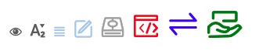
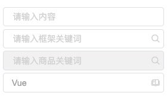
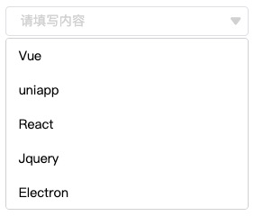

# Icon 图标

**API**

| 属性 | 说明 | 类型 | 默认值 |
| :-: | :-: | :-: | :-: |
| type | icon样式代码 | String | 无 |
| size | icon样式大小 | Number | 16 |
| color | icon样式颜色 | String | #ccc |

**示例图**

**Icon样式代码请前往: [CgUI图标库](http://icon.codegorgeous.top)**

# Button 按钮

**API**

| 属性 | 说明 | 类型 | 默认值 |
| :-: | :-: | :-: | :-: |
| type | 按钮类型 | String | 无 |
| disabled | 禁用按钮 | Boolean | false |
| ghost | 背景是否透明化 | Boolean | false |

**示例图**

# Praise 好评

**API**

| 属性 | 说明 | 类型 | 默认值 |
| :-: | :-: | :-: | :-: |
| quantity | 选中的数量 | Number | 0 |
| size | 图标的大小 | Number | 16 |
| disabled | 禁用按钮 | Boolean | false |

**示例图**

# Empty 空数据

**API**

| 属性 | 说明 | 类型 | 默认值 |
| :-: | :-: | :-: | :-: |
| title | 文字说明 | String | 'Not Data' |

**示例图**

# Input 输入框

**API**

| 属性 | 说明 | 类型 | 默认值 |
| :-: | :-: | :-: | :-: |
| value.sync | 输入框绑定数据 | String | '' |
| placeholder | 输入框默认显示 | String | '请输入内容' |
| icon | 输入框图标 | String | '' |
| disabled | 输入框是否禁用 | Boolean | false |

**Events**

| 事件名称 | 事件说明 | 回调参数 |
| :-: | :-: | :-: |
| inputOpenShow | 焦点聚焦输入框 | 无 |
| inputCloseShow | 焦点移出输入框 | 无 |

**示例图**

# Select 下拉输入框

**API**

| 属性 | 说明 | 类型 | 默认值 |
| :-: | :-: | :-: | :-: |
| data | 下拉菜单数据 | Array | [] |

**Events**

| 事件名称 | 事件说明 | 回调参数 |
| :-: | :-: | :-: |
| selectValue | 选择下拉列表的数据 | 目标选中值 |

**示例图**

