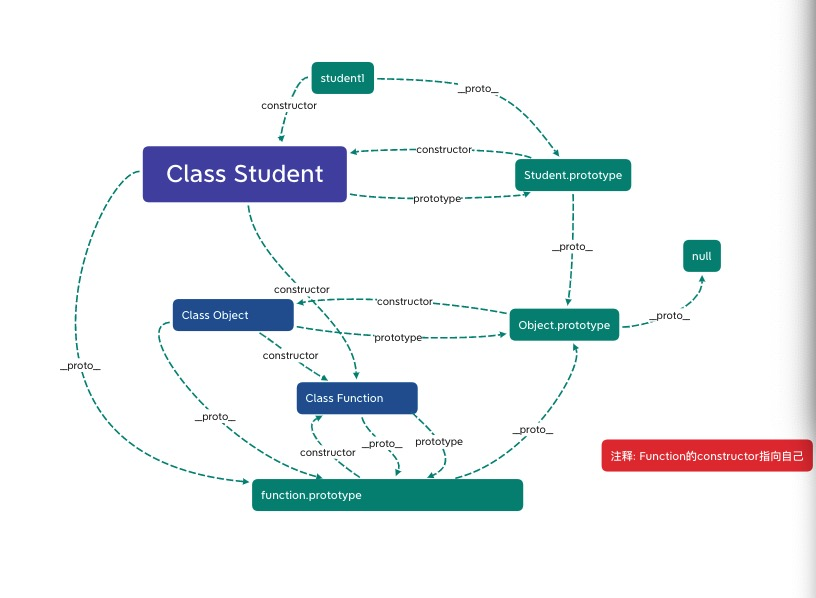

# JavaScript八股文

# 如何理解作用域?

## 答: 作用域可以被分为三种，全局作用域 ｜ 函数作用域 ｜ 块级作用域。

### 全局作用域: 任何不在函数内声明的变量或者在打括号内声明的变量都会在全局作用域内存放

### 函数作用域: 在函数体内部声明的变量在全局内是无法访问到的，只能够在当前函数体内使用该变量

### 块级作用域: 在大括号内使用Es6语法let/const声明的变量是无法在大括号外部进行访问该变量的

### 查询变量的顺序: 当前作用域 -> 当前作用域上层 -> ... -> 全局作用域

```
    var name = "CodeGorgeous"
    function print() {
        // 如果有第19行代码则打印出的name值为xingjun
        // var name = 'xingjun'
        function getName() {
            console.log(name) // CodeGorgeous
        }
        getName()
    }
    print()
```

# == 和 === 的区别? 分别在什么情况下使用?

## 答: ==会进行类型转换进行比较, ===是不会进行类型转换直接进行比较的。除了值为null或者undefined的情况下用相等，建议其他情况下采用全等

```
    const obj1 = {
        a: 1
    }
    const obj2 = obj1
    const obj3 = {
        a: 1
    }
    // == 相等
    console.log(true == 1) // true
    console.log(false == 0) // true
    console.log('1' == 1) // true
    console.log(null == null) // true
    console.log(undefined == undefined) // true
    console.log(null == undefined) // true
    console.log(NaN == NaN) // false
    console.log(NaN == null) // false
    console.log(NaN == undefined) // false
    console.log(obj1 == obj2) // true 引用类型比较的是地址
    console.log(obj1 == obj3) // false

    // === 全等
    console.log(true === 1) // false
    console.log(false === 0) // false
    console.log('1' === 1) // false
    console.log(1 === 1) // true
    console.log(null === null) // true
    console.log(undefined === undefined) // true
    console.log(null === undefined) // false
    console.log(NaN === NaN) // false
    console.log(NaN === null) // false
    console.log(NaN === undefined) // false
    console.log(obj1 === obj2) // true 引用类型比较的是地址
    console.log(obj1 === obj3) // false
```

# 如何理解原型? 原型链?

## 答: 此回答不固定，请看图自行理解在进行回答

### 一张图帮你理解原型链

```
    class Student {
        constructor(name) {
            this.name = name
        }
    }
    const student1 = new Student('CodeGorgeous')
```



# 如何理解闭包?

## 答: 闭包就是使一个嵌套函数能够访问到外层函数,可以用于创建私有化变量, 延长变量的生命周期

### 闭包的特点: 函数嵌套函数, 嵌套函数可以引用外层函数的参数, 函数执行完毕后其内部变量不会销毁(原始作用域链不释放,造成内存泄露)

```
    function print() {
        const name = 'xingjun'
        return function () {
            console.log(name)
        }
    }
    const result = print() // 正常函数在执行完毕后会销毁其内部参数
    result() // xingjun     在闭包中则会保留其执行期上下文, 不会销毁掉其上下文

    function print2() {
        let i = 0
        return function() {
            console.log(i++)
        }
    }
    const result1 = print2() // 
    result1()
    result1()
    const result2 = print2() // 如果再次调用是不会受到之前影响的
    result2()
    result2()
```
### 闭包的常见问题及其解决方案
```
    function print3() {
        let arr =[]
        for(var i = 0; i < 10; i++) {
            arr[i] = function() {
                console.log(i)
            }
        }
        return arr
    }
    const result3 = print3()
    for(let i = 0; i < result3.length; i++) {
        result3[i]() // 会打印出的值都为10
    }

    // 第一种解决方法:
    // 使用立即执行函数
    function print4() {
        let arr =[]
        for(var i = 0; i < 10; i++) {
            (function(j) {
                arr[j] = function() {
                    console.log(j)
                }
            })(i)
        }
        return arr
    }
    const result4 = print4()
    for(let i = 0; i < result4.length; i++) {
        result4[i]() // 0 1 2 3 4 5 6 7 8 9
    }

    // 第二种解决方法:
    // 使用es6都let
    // 为什么let能够解决这种问题?
    //  原因: let是存在块级作用域的, 每次遍历会产生新的作用域, 作用域之间不会互相影响
    function print5() {
        let arr =[]
        for(let i = 0; i < 10; i++) {
            arr[i] = function() {
                console.log(i)
            } 
        }
        return arr
    }
    const result5 = print5()
    for(let i = 0; i < result5.length; i++) {
        result5[i]() // 0 1 2 3 4 5 6 7 8 9
    }
```

# 如何理解继承? 怎么能够实现继承?

## 答: 继承可以理解为B继承了A, 那么A就是B的父类, B就是A的子类

### 继承的优势: 可以少写许多不必要的重复的方法和属性, 子类可以使用到父类的属性和方法, 也可以自己对其一些方法和属性进行重写

### ES6继承演示
```
    class People{
        constructor(name,phone) {
            this.name = name
            this.phone = phone
        }
        // 写
        write(content) {
            return content
        }
        // 读
        read() {
            return `我叫${this.name},我的电话为${this.phone}`
        }
    }

    // Male继承People
    class Male extends People{
        constructor(name,phone) {
            super(name,phone)
            this.sex = '男'
        }
        // 可以自己对其父类的方法进行重写,但是不会影响到父类
        read() {
            return `我叫${this.name},我是个${this.sex}孩子,我的电话为${this.phone}`
        }
        // 自己新增的独有的方法
        song() {
            return `
            See You Again
            It's been a long day without you my friend
            And I'll tell you all about it when I see you again
            We've come a long way from where we began
            Oh I'll tell you all about it when I see you again
            `
        }
    }
    const male = new Male('CodeGorgeous','176xxxxx940')
    console.log(male.write('集中一点,登峰造极')) // 芜湖起飞🛫️
    console.log(male.read()) // 我叫CodeGorgeous,我是个男孩子,我的电话为176xxxxx940
    console.log(male.song()) // See You Again ...... Oh I'll tell you all about it when I see you again

    class WoMan extends People{
        constructor(name,phone) {
            super(name,phone)
            this.sex = '女'
        }
        // 自己新增的独有的方法
        read() {
            return `我叫${this.name},我是个${this.sex}孩子,我的电话为${this.phone}`
        }
        // 
        dance() {
            return `💃💃💃💃💃💃💃💃💃💃💃💃💃💃💃💃💃💃`
        }
    }
    const woman = new WoMan('maomao','178xxxxx066')
    console.log(woman.write('蜡笔小新')) // 蜡笔小新
    console.log(woman.read()) // 我叫maomao,我是个女孩子,我的电话为178xxxxx066
    console.log(woman.dance()) // 💃💃💃💃💃💃💃💃💃💃💃💃💃💃💃💃💃💃
```

### 实现继承的方式

#### 寄生组合式继承

#### Es6的继承基本类似于寄生组合式继承

```
    // 实现寄生组合式继承
    function People(name,phone) {
        this.name = name
        this.phone = phone
    }
    People.prototype.write = function(content) {
        return content
    }
    People.prototype.read = function() {
        return `我叫${this.name},我的电话为${this.phone}`
    }

    function Male(name,phone) {
        People.call(this,name,phone)
        this.sex = '男'
    }
    Male.prototype = Object.create(People.prototype)
    Male.prototype.constructor = Male

    Male.prototype.read = function() {
        return `我叫${this.name},我是个${this.sex}孩子,我的电话为${this.phone}`
    }
    Male.prototype.song = function() {
            return `
                See You Again
                It's been a long day without you my friend
                And I'll tell you all about it when I see you again
                We've come a long way from where we began
                Oh I'll tell you all about it when I see you again
            `
    }
    const male = new Male('CodeGorgeous','176xxxxx940')
    console.log(male.write('集中一点,登峰造极')) // 集中一点,登峰造极
    console.log(male.read()) // 我叫CodeGorgeous,我是个男孩子,我的电话为176xxxxx940
    console.log(male.song()) // See You Again ...... Oh I'll tell you all about it when I see you again

    function WoMan(name,phone) {
        People.call(this,name,phone)
        this.sex = '女'
    }
    WoMan.prototype = Object.create(People.prototype)
    WoMan.prototype.constructor = WoMan
    WoMan.prototype.read = function() {
        return `我叫${this.name},我是个${this.sex}孩子,我的电话为${this.phone}`
    }
    WoMan.prototype.dance = function() {
        return `💃💃💃💃💃💃💃💃💃💃💃💃💃💃💃💃💃💃`
    }
    const woman = new WoMan('maomao','178xxxxx066')
    console.log(woman.write('蜡笔小新')) // 蜡笔小新
    console.log(woman.read()) // 我叫maomao,我是个女孩子,我的电话为178xxxxx066
    console.log(woman.dance()) // 💃💃💃💃💃💃💃💃💃💃💃💃💃💃💃💃💃💃
```

# 如何理解this指向?

**注意: 这里只讨论非严格模式下**

## 答: this的指向在函数创建阶段是无法确定的, 在绝大多数的情况下是谁调用了this就指向谁

### 其他情况:

```
    let obj = {
        a: 1,
        b: {
            a: 2,
            print() {
                console.log(this.a)
            }
        }
    }
    obj.b.print() // 2 // this不会产生作用域链这样形式的存在,就只会根据上一级的对象
    const result = obj.b.print
    result() // undefined 为什么这里会指向Window? 因为仔细看现在调用该函数的环境已经处于Window中,或者说result已经处于Window环境中

    // 特殊的一种例子
    function print(name) {
        this.name = name
        return
    }
    const print1 = new print('CodeGorgeous') // 注意点: new关键词会改变this指向, 会指向实例对象(返回一个引用类型(null)例外)
    console.log(print1.name) // xingjun 当函数返回值为一个引用类型(null除外)的时候, this会指向到返回的对象内
```

# 如何理解执行期上下文和执行栈?

## 答: 执行期上下文分为全局执行期上下文、函数执行期上下文、Eval执行期上下文(比较特殊的一个). 执行栈也叫做调用栈, 用于存储执行期上下文

### 执行期上下文存在生命周期: 创建阶段 -> 执行阶段 -> 回收阶段 

### 执行栈会在代码开始运行的时候创建一个全局执行期上下文操作, 并将其压入栈中, 每执行到函数的时候就创建一个函数执行期上下文操作, 也会压入栈中, 当函数执行完毕后就会将该函数的执行期上下文推出栈, 当执行完成代码后就会将全局执行期上下文推出栈, 程序运行完成

**更加详细请参考: [点击进入](https://mp.weixin.qq.com/s/FUYdVhz7KVCiSE_rDhVJUA)**

# 如何理解事件模型?

## 答: 事件模型可以分为三种: 原始事件模型、标准事件模型、IE事件模型

### 原始事件模型

#### 特点: 支持冒泡, 不支持捕获, 同一类型的事件只能绑定一个函数

```
    const oBtn = document.querySelector('button')

    oBtn.onclick = (e) => {
        console.log('原始事件模型', '1', e)
    }
    oBtn.onclick = (e) => {
        console.log('原始事件模型', '2', e)
    }

    // 当点击按钮后, 只会触发最后一个函数

    // 取消事件方式
    oBtn.onclick = null
```

### 标准事件模型

#### 特点: 支持冒泡, 支持捕获, 同一类型事件可绑定多个函数

```
    const oBtn = document.querySelector('button')

    oBtn.addEventListener('click', clickOne)
    function clickOne(e) {
        console.log('clickOne', e)
    }
    // 第三个参数决定了这个事件绑定的这个函数是在哪个阶段执行, false为冒泡阶段, true为捕获阶段, 默认为false
    oBtn.addEventListener('click', clickTwo, true)
    function clickTwo(e) {
        console.log('clickTwo', e)
    }
    // 当点击按钮后, 先触发clickTwo然后触发clickOne

    // 取消事件方式
    oBtn.removeEventListener('click', clickOne)
```

### IE事件模型

#### 由于本人无IE浏览器所以无法实测, 关于IE事件模型请[点击进入](https://blog.csdn.net/Picking_up_stones/article/details/61926228)

# 如何理解typeof和instanceof的区别?

## 答: typeof会返回数据的类型, instanceof会顺着原型链进行查找(无法正确判断基本类型), 找到则为true反之为false, 一般typeof用于判断基本类型, instanceof用于判断复杂类型,但是在判定数组是也要多判断一次, 因为Array也属于Object, 一般推荐使用Object.prototype.toString.call(target)进行判别数据类型

```
    // typeof
    console.log(typeof 1) // number
    console.log(typeof '1') // string
    console.log(typeof Symbol()) // symbol  于Es6加入基本类型
    console.log(typeof 1n) // bigint    于ES2019加入基本类型
    console.log(typeof true) // boolean
    console.log(typeof undefined) // undefined
    console.log(typeof null) // object
    console.log(typeof NaN) // number
    console.log(typeof []) // object    数据类型不准确
    console.log(typeof {}) // object
    console.log(typeof function(){}) // function

    // instanceof
    console.log(1 instanceof Number) // false   无法判断基本类型
    console.log([] instanceof Array) // true
    console.log([] instanceof Object) // true 由于Array也属于Object所以对于判定是否为数组时应该多判断一下
    console.log({} instanceof Object) // true

    // 推荐使用判断数据类型的方法
    console.log(Object.prototype.toString.call(1)) // [object Number]
    console.log(Object.prototype.toString.call('1'))// [object String]
    console.log(Object.prototype.toString.call(true)) // [object Boolean]
    console.log(Object.prototype.toString.call(Symbol())) // [object Symbol]
    console.log(Object.prototype.toString.call(1n)) // [object Bigint]
    console.log(Object.prototype.toString.call(undefined)) // [object Undefined]
    console.log(Object.prototype.toString.call(null)) // [object Null]
    console.log(Object.prototype.toString.call(function(){})) // [object Function]
    console.log(Object.prototype.toString.call([])) // [object Array]
    console.log(Object.prototype.toString.call({})) // [object Object]
```